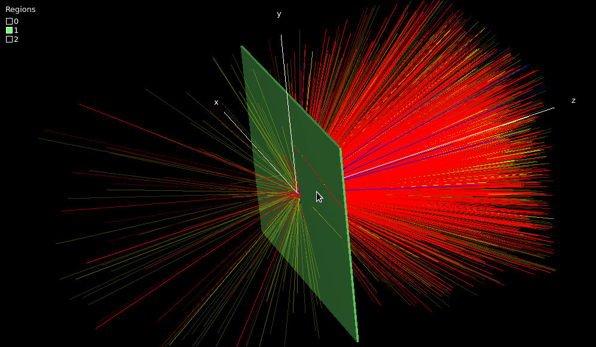

# 1. Getting started: run your first EGSnrc simulation <!-- omit in toc -->


- [1.1. Install EGSnrc](#11-install-egsnrc)
- [1.2. Write your own egs++ application](#12-write-your-own-egs-application)
- [1.3. Add a dose scoring object](#13-add-a-dose-scoring-object)
- [1.4. Explore the simulation parameters](#14-explore-the-simulation-parameters)
- [1.5. Monitor a simulation in detail](#15-monitor-a-simulation-in-detail)



## 1.1. Install EGSnrc

### Download and configure

Open a terminal and run the following commands to download the EGSnrc source code and configure it for this course:

```bash
cd $HOME                                          # go to your home directory
git clone https://github.com/nrc-cnrc/EGSnrc.git  # download EGSnrc
cd EGSnrc/                                        # go inside the EGSnrc directory
git checkout develop                              # switch to the development branch
HEN_HOUSE/scripts/configure.expect course 3       # configure for this course, without compiling applications
```

⚠️ EGSnrc must be installed in a path with **no spaces** in any folder name.

<details style="margin-bottom:1em">
<summary style="margin-bottom:0.5em">💡 New to the terminal?</summary>
<div style="background:#ffeedd;padding:1em 2em 0.2em">

Each line above is a command. Type (or paste) one line at a time and press **Enter**.

- `cd` means *change directory* — it moves you into a folder
- `$HOME` is a variable that holds the path to your home directory (e.g., `/home/student`)
- `git clone` downloads a copy of the code from GitHub
- `git checkout` switches to a specific version (branch) of the code

</div>
</details>

### Set up your environment

EGSnrc needs three environment variables to work. To define them, open the file  `$HOME/.bashrc` in VS Code from the terminal:

```bash
code $HOME/.bashrc &
```

Add the following three lines at the bottom of the file:

```bash
export EGS_HOME=$HOME/EGSnrc/egs_home/
export EGS_CONFIG=$HOME/EGSnrc/HEN_HOUSE/specs/course.conf
source $HOME/EGSnrc/HEN_HOUSE/scripts/egsnrc_bashrc_additions
```

Then reload the file in your current terminal session:

```bash
source $HOME/.bashrc
```

<details style="margin-bottom:1em">
<summary style="margin-bottom:0.5em">💡 What is <code>.bashrc</code>?</summary>
<div style="background:#ffeedd;padding:1em 2em 0.2em">

The file `$HOME/.bashrc` runs automatically every time you open a new terminal. It sets up your environment — things like search paths and variables. Files starting with `.` are hidden by default; VS Code will still open them if you give the full path.

</div>
</details>

<details style="margin-bottom:1em">
<summary style="margin-bottom:0.5em">💡 What is the <code>&</code> character at the end of a command?</summary>
<div style="background:#ffeedd;padding:1em 2em 0.2em">


The `&` at the end of a command runs the program in the background so you can keep typing in the terminal.

</div>
</details>

<details style="margin-bottom:1em">
<summary style="margin-bottom:0.5em">🔑 What do these three variables mean?</summary>
<div style="background:#ffeedd;padding:1em 2em 0.2em">


| Variable     | Purpose                                                           |
| ------------ | ----------------------------------------------------------------- |
| `EGS_HOME`   | Your working area — where your applications and input files live  |
| `EGS_CONFIG` | Points to the configuration file for your EGSnrc build            |
| `HEN_HOUSE`  | The EGSnrc system directory (set automatically by the third line) |

You will see these variables throughout the course.

</div>
</details>

### Verify the installation

Confirm that the environment is set up correctly:

```bash
echo $EGS_HOME
```

This should print something like `/home/student/EGSnrc/egs_home/`. If it prints a blank line, go back and make sure you edited `.bashrc` and ran the `source` command.

<details style="margin-bottom:1em">
<summary style="margin-bottom:0.5em">💡 Why the <code>$</code> sign?</summary>
<div style="background:#ffeedd;padding:1em 2em 0.2em">

The `$` tells the shell you want the *value* of a variable, not its name. Try both to see the difference:

```bash
echo $EGS_HOME     # prints /home/student/EGSnrc/egs_home/
echo EGS_HOME      # prints the literal text EGS_HOME
```

</div>
</details>

### Build the graphical user interfaces (GUIs)

EGSnrc includes GUIs, notably `egs_view` for 3D visualization of geometries and particle tracks, and `egs_gui` for creating material data. Build them now — you will use `egs_view` shortly in section 1.2:

```bash
cd $HEN_HOUSE/egs++/view/       # go inside the egs_view source code directory
make                            # build egs_view (don't worry about the warnings)

cd $HEN_HOUSE/gui/egs_gui/      # go inside the egs_gui source code directory
make                            # build egs_gui (don't worry about the warnings)
```

<details style="margin-bottom:1em">
<summary style="margin-bottom:0.5em">💡 What does <code>make</code> do?</summary>
<div style="background:#ffeedd;padding:1em 2em 0.2em">

`make` reads a file called `Makefile` and compiles source code into an executable program. You do not need to understand Makefiles for this course — just run `make` when instructed.

</div>
</details>

## 1.2. Write your own egs++ application

All EGSnrc applications must reside in their own folder inside `$EGS_HOME/`. Create a new folder called `myapp` and move into it:

```bash
cd $EGS_HOME
mkdir myapp               # create a new directory (mkdir means: "make" directory)
cd myapp
```

You are going to create **four** files in this folder: two C++ source files, a Makefile, and an input file. For each file below, open VS Code and use **File → New File** to create it, or run `code filename &` from the terminal.

### Write the C++ source code

Create a file named `array_sizes.h` with the following content. It defines two compile-time limits: the maximum number of media and the maximum particle stack size in your simulation.

```c++
#define MXMED 100
#define MXSTACK 10000
```

Create a file named `myapp.cpp`:

```c++
#include "egs_advanced_application.h"
APP_MAIN (EGS_AdvancedApplication);
```

This is the smallest fully functional EGSnrc application you can write! It is so short because the egs++ library handles all the simulation work behind the scenes.

### Write a Makefile

Create a file named `Makefile` with the following boilerplate. The only line specific to your application is the name `myapp`:

```makefile
include $(EGS_CONFIG)
include $(SPEC_DIR)egspp1.spec
include $(SPEC_DIR)egspp_$(my_machine).conf

USER_CODE = myapp    # the name of your application, matching the name of the application directory

EGS_BASE_APPLICATION = egs_advanced_application
CPP_SOURCES = $(C_ADVANCED_SOURCES)
other_dep_user_code = $(ABS_EGSPP)egs_scoring.h
include $(HEN_HOUSE)makefiles$(DSEP)cpp_makefile
```

### Build it

Compile the application with `make`, which produces the executable `myapp` in `$EGS_HOME/bin/`:

```bash
make
```

If you ever modify the source code, run `make` again to recompile.

### Write an input file

To run a simulation you need an input file describing the geometry, materials, particle source and what to calculate. You will learn to write these from scratch later in the course, but for now create a file named `slab.egsinp` with the content below. It models **a thousand 20 MeV electrons incident on a 1 mm thick tantalum plate.**

An egs++ input file is organized in a few main blocks:

| Block              | Purpose                                                   |
| :----------------- | :-------------------------------------------------------- |
| **run control**    | how many particles to simulate                            |
| **geometry**       | the physical setup (shapes, dimensions, regions)          |
| **media**          | material properties and energy cutoffs                    |
| **source**         | the incident beam (type, energy, direction)               |
| **ausgab objects** | what to extract from the simulation (scores, tracks, ...) |

Read through the file below and note the inline comments — they highlight important details.

```yaml
################################################################################
#
# Simple slab simulation
#
################################################################################

#===============================================================================
# Run control
#===============================================================================
:start run control:
    ncase = 1000                             # number of incident particles
:stop run control:

#===============================================================================
# Geometry
#===============================================================================
:start geometry definition:

    ### plate
    :start geometry:
        name     = slab
        library  = egs_ndgeometry
        type     = EGS_XYZGeometry
        x-planes = -5, 5                    # in cm
        y-planes = -5, 5                    # in cm
        z-planes = -10, 0, 0.1, 10          # in cm → defines 3 regions:
                                            #   region 0: z = -10 to 0   (vacuum)
                                            #   region 1: z =  0  to 0.1 (plate)
                                            #   region 2: z =  0.1 to 10 (vacuum)
        :start media input:
            media = vacuum tantalum         # define 2 media: vacuum (index 0), tantalum (index 1)
            set medium = 1 1                # assign medium 1 (tantalum) to region 1 (the plate)
        :stop media input:
    :stop geometry:

    ### use this geometry for the simulation
    simulation geometry = slab

:stop geometry definition:

#===============================================================================
# Media
#===============================================================================
:start media definition:

    ### cutoff energies
    ae  = 0.521
    ap  = 0.010
    ue  = 50.511
    up  = 50

    ### tantalum
    :start tantalum:
        density correction file = tantalum
    :stop tantalum:

    ### lead
    :start lead:
        density correction file = lead
    :stop lead:

    ### water
    :start water:
        density correction file = water_liquid
    :stop water:

:stop media definition:

#===============================================================================
# Source
#===============================================================================
:start source definition:

    ### pencil beam
    :start source:
        name      = pencil_beam
        library   = egs_parallel_beam
        charge    = -1                      # -1 = electron, 0 = photon, 1 = positron
        direction = 0 0 1                   # along the z axis
        :start spectrum:
            type = monoenergetic
            energy = 20                     # in MeV
        :stop spectrum:
        :start shape:
            type     = point
            position = 0 0 -10              # starting position in x, y, z (cm)
        :stop shape:
    :stop source:

    ### use this source for the simulation
    simulation source = pencil_beam

:stop source definition:

#===============================================================================
# Viewer control
#===============================================================================
:start view control:
    set color = lead      120 120 200 200
    set color = tantalum  120 255 120 255
    set color = water       0 220 255 200
:stop view control:

#===============================================================================
# Ausgab objects
#===============================================================================
:start ausgab object definition:

    ### particle tracks
    :start ausgab object:
        name    = tracks
        library = egs_track_scoring
    :stop ausgab object:

:stop ausgab object definition:
```

### Run it

Launch the simulation:

```bash
myapp -i slab.egsinp
```

<details style="margin-bottom:1em">
<summary style="margin-bottom:0.5em">💡 What does <code>-i</code> mean?</summary>
<div style="background:#ffeedd;padding:1em 2em 0.2em">

The `-i` flag specifies the input file. This is a common convention: most command-line programs accept *flags* (also called *options*) that start with `-` to control their behavior. Such options are often followed by an *argument*, here the file name `slab.egsinp`.

</div>
</details>

The simulation runs in a few seconds and prints results to the terminal. It also saves particle track data to the file `slab.ptracks`.

### Visualize the geometry and tracks

Open the geometry and tracks in the 3D viewer:

```bash
egs_view slab.egsinp slab.ptracks
```

In the viewer, check the **Show tracks** box, then explore:

| Action | Control                  |
| ------ | ------------------------ |
| Rotate | left mouse button        |
| Zoom   | scroll wheel             |
| Pan    | Ctrl + left mouse button |

Notice the thin tantalum plate at the center. The electron tracks fan out through the plate, and some produce secondary particles emerging on both sides.

Congratulations — you created your first egs++ application and ran your first simulation!

### Question

- Aside from particle tracks, does `myapp` provide any useful information when it runs, such as energy deposited, dose, or spectrum?

## 1.3. Add a dose scoring object

By default, `myapp` just transports particles through the geometry without reporting any quantity of interest. To extract results you add *scoring objects* to the input file.

Open `slab.egsinp` and find the `ausgab object definition` block at the bottom. Add a new dose scoring object **after** the existing track scoring object **inside** the `ausgab object definition` block. It should look like this:

```yaml
#===============================================================================
# Ausgab objects
#===============================================================================
:start ausgab object definition:

    ### generate particle tracks
    :start ausgab object:
        name    = tracks
        library = egs_track_scoring
    :stop ausgab object:

    ### report dose in region 1 (the plate)
    :start ausgab object:
        name         = dose
        library      = egs_dose_scoring
        dose regions = 1                     # region 1 = the tantalum plate
        volume       = 10                    # 10 × 10 × 0.1 = 10 cm³
    :stop ausgab object:

:stop ausgab object definition:
```

⚠️ Keep the existing track scoring object — just add the new block alongside it.

<details style="margin-bottom:1em">
<summary style="margin-bottom:0.5em">💡 What does "ausgab" mean?</summary>
<div style="background:#ffeedd;padding:1em 2em 0.2em">

[*Ausgabe*](https://translate.google.com/?sl=de&tl=en&text=ausgabe&op=translate) is a German word for "output." It is a historical term from the original EGS4 code (developed partly at DESY in Hamburg) that stuck around in EGSnrc. An ausgab object is simply a module that extracts and reports information from the simulation.

</div>
</details>

Run the simulation again and look for the **Summary of region dosimetry** in the output:

```bash
myapp -i slab.egsinp
```

### Questions

- How much energy is deposited inside the tantalum plate? What is the dose?

- Can you manually convert the deposited energy to dose, assuming that the density of tantalum is 16.654 g/cm³?

- What is the relative uncertainty on energy and dose, and why is it the same for both?

- Increase `ncase` by a factor of 10 in the input file and run again. Why has the deposited energy *not* increased by a factor of 10? What happened to the uncertainty?

<details style="margin-bottom:1em">
<summary style="margin-bottom:0.5em">💡 Hint on uncertainty</summary>
<div style="background:#ffeedd;padding:1em 2em 0.2em">

Think about how the statistical uncertainty of a mean value scales with the number of samples $N$.

</div>
</details>

## 1.4. Explore the simulation parameters

A good way to build intuition about particle transport is to change one variable at a time and observe the effect. In each scenario below, edit `slab.egsinp`, run the simulation, and view the tracks:

```bash
myapp -i slab.egsinp
egs_view slab.egsinp slab.ptracks
```

### Scenario A — Photons instead of electrons

Change the incident particle type to photons and set `ncase = 1e4`. Refer to the `charge` parameter in the source definition input block.

**Questions:**

- Is the simulation faster with electrons or with photons?
- How did the dose change compared to electrons?
- Are positrons generated in this simulation? Is this expected at 20 MeV?

### Scenario B — Lower photon energy

Keep photons from the previous scenario, but change the energy to 1 MeV.

**Questions:**

- What is the biggest qualitative difference in the particle tracks compared to 20 MeV?

<details style="margin-bottom:1em">
<summary style="margin-bottom:0.5em">💡 Hint on the qualitative difference</summary>
<div style="background:#ffeedd;padding:1em 2em 0.2em">

Look for pair production events. What is the energy threshold for pair production?

</div>
</details>

- Did the dose increase or decrease?
- How about the simulation time, did it increase or decrease? Why?

### Scenario C — Low-energy electrons on lead

Reset the source to **100 keV electrons** and change the plate material to `lead`. Keep `ncase = 1e4`.

⚠️ There are three changes here: particle type, energy, *and* material. Double-check all three before running.

**Questions:**

- What is happening to the electrons hitting the lead plate?
- Is that consistent with the deposited energy?
- What is the file size of `slab.ptracks` on disk?

<details style="margin-bottom:1em">
<summary style="margin-bottom:0.5em">💡 How to check a file size in the terminal</summary>
<div style="background:#ffeedd;padding:1em 2em 0.2em">

```bash
ls -lh slab.ptracks       # -l = detailed listing, -h = human-readable sizes
```

</div>
</details>

### Scenario D — Electrons in water (stopping power check)

Change the plate material to `water` and the source to **20 MeV electrons**. Keep `ncase = 1e4`.

**Questions:**

- The mass stopping power for 20 MeV electrons in liquid water is 2.454 MeV·cm²/g. Is the deposited energy from your simulation consistent with this value?

<details style="margin-bottom:1em">
<summary style="margin-bottom:0.5em">💡 Hint on the stopping power check</summary>
<div style="background:#ffeedd;padding:1em 2em 0.2em">

The mass stopping power $S/\rho$ gives energy loss per unit *areal density* (density × thickness). For a 0.1 cm plate of water ($\rho$ = 1.0 g/cm³), we expect:

$$\Delta E \approx \frac{S}{\rho} \times \rho \times t = 2.454 \times 1.0 \times 0.1 = 0.2454 \text{ MeV}$$

Compare this to the deposited energy per incident electron reported by the simulation.

</div>
</details>

## 1.5. Monitor a simulation in detail

The `tutor4pp` application lets you follow a simulation interaction by interaction. A copy of `slab.egsinp` with `ncase = 1` is already in the `tutor4pp` directory. Compile and run it:

```bash
cd $EGS_HOME/tutor4pp
make
tutor4pp -i slab.egsinp
```

### Reading the output

The output traces a **single** 20 MeV electron through the 1 mm tantalum plate. Each event is printed on one line with the following columns:

| Column   | Meaning                                                  |
| -------- | -------------------------------------------------------- |
| `iarg`   | event type code                                          |
| `event`  | description of the interaction                           |
| `NP`     | index of the top-most particle on the stack              |
| `charge` | −1 = electron, 0 = photon, +1 = positron                 |
| `energy` | total energy in MeV (kinetic + rest mass)                |
| `region` | geometry region (0, 2 = vacuum; 1 = plate; −1 = escaped) |
| `x y z`  | particle position in cm                                  |
| `u v w`  | particle velocity direction cosines                      |

EGSnrc keeps track of all active particles on a **stack** (a pile): when an interaction creates secondary particles, they are added on top of the pile to be processed next. It is just like a pile of pancakes — except not as delicious. The top one is consumed next.

In `tutor4pp`, after each interaction, the full stack is printed so you can see all particles in flight (it is printed downwards, so the top is at the bottom!). The labels `NPold` and `NP` indicate the particle on top of the stack before and after the interaction, respectively.

A particle is removed from the simulation either when its energy drops below the cutoff threshold (`Energy below AE or AP`) or when it leaves the geometry (`User discard`, with `region = -1`).

Look through the output and trace what happened: the primary electron undergoes a series of Møller scatterings (creating knock-on electrons) and a few bremsstrahlung events (creating photons). Most knock-on electrons are immediately discarded because their energy is below the electron cutoff `AE`. Bremsstrahlung photons either escape the geometry or get absorbed via the photoelectric effect, sometimes producing fluorescence photons. The primary electron itself eventually exits the plate.

### Run with more histories

Now change `ncase` to 100 in `slab.egsinp` and run again. The output is long, so redirect it to a file:

```bash
tutor4pp -i slab.egsinp > output.dat
```

<details style="margin-bottom:1em">
<summary style="margin-bottom:0.5em">💡 What does <code>></code> do?</summary>
<div style="background:#ffeedd;padding:1em 2em 0.2em">

The `>` operator redirects the terminal output into a file instead of printing it on screen. ⚠️  If the file already exists, it is overwritten without any warning!

</div>
</details>

You can open `output.dat` in VS Code, or page through it in the terminal with the `less` command:

```bash
less output.dat
```

<details style="margin-bottom:1em">
<summary style="margin-bottom:0.5em">💡 Using the <code>less</code> pager utility</summary>
<div style="background:#ffeedd;padding:1em 2em 0.2em">

- **Space** or **Page Down** — next page
- **b** or **Page Up** — previous page
- **/** — (forward slash) search for text: type in a word, then press `Enter`
- **q** — quit

</div>
</details>

### Questions

- What is the most common type of interaction overall in this simulation?

- How many incident electrons create an initial bremsstrahlung photon vs. a knock-on electron (via Møller scattering)?

- What is the largest number of particles on the stack at once, and how did it occur?

- Are most particles discarded because they fall below an energy cutoff, or because they leave the geometry?

<details style="margin-bottom:1em">
<summary style="margin-bottom:0.5em">💡 Hint on counting events</summary>
<div style="background:#ffeedd;padding:1em 2em 0.2em">

You can list occurrences of a specific string in a file with `grep`, for example:

```bash
grep "Moller" output.dat
grep "Bremsstrahlung" output.dat
```

You can also just count them with the `-c` (count) option in `grep`:

```bash
grep -c "Moller" output.dat
grep -c "Bremsstrahlung" output.dat
```

</div>
</details>

---

### [Solutions laboratory 1](Lab-01-solutions.md)
